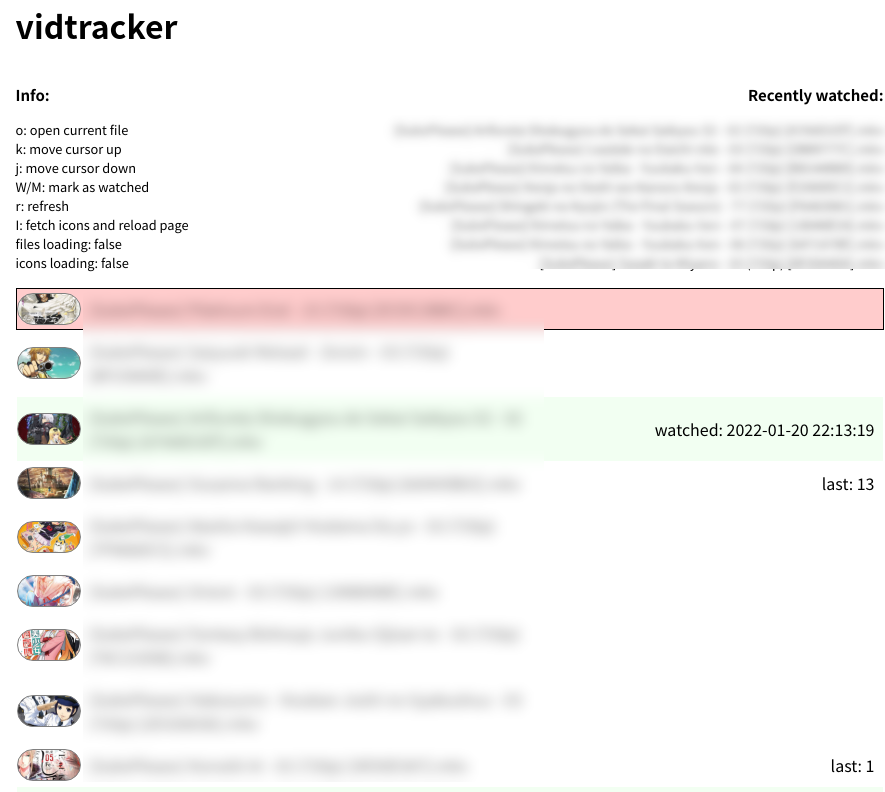

# vt2

yet another vidtracker

the aim of this project is to make something with the least actual effort, while trying to make sure everything can be debugged easily.



---

```
$ tail -f /tmp/local.vt2.*
$ launchctl unload ./local.vt2.plist; launchctl load ./local.vt2.plist
```
